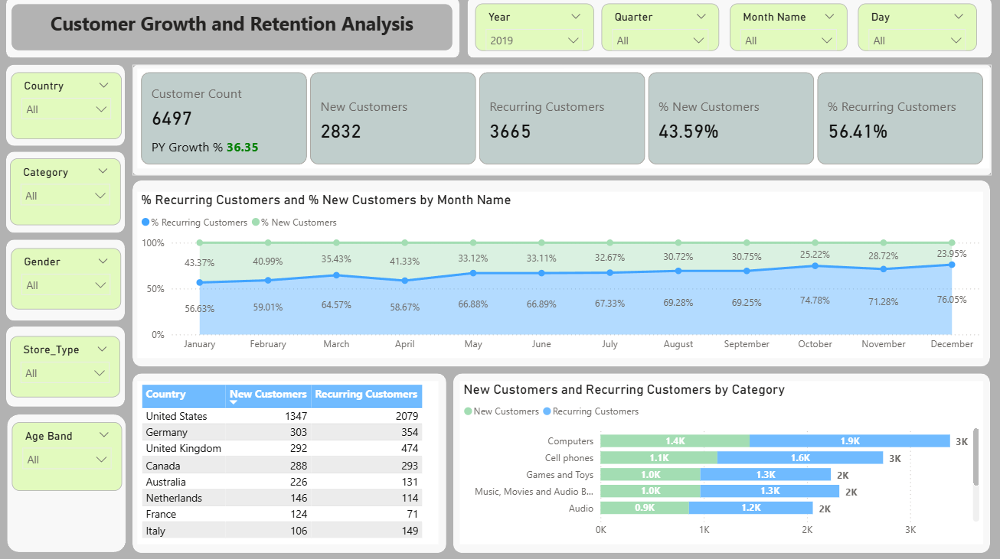
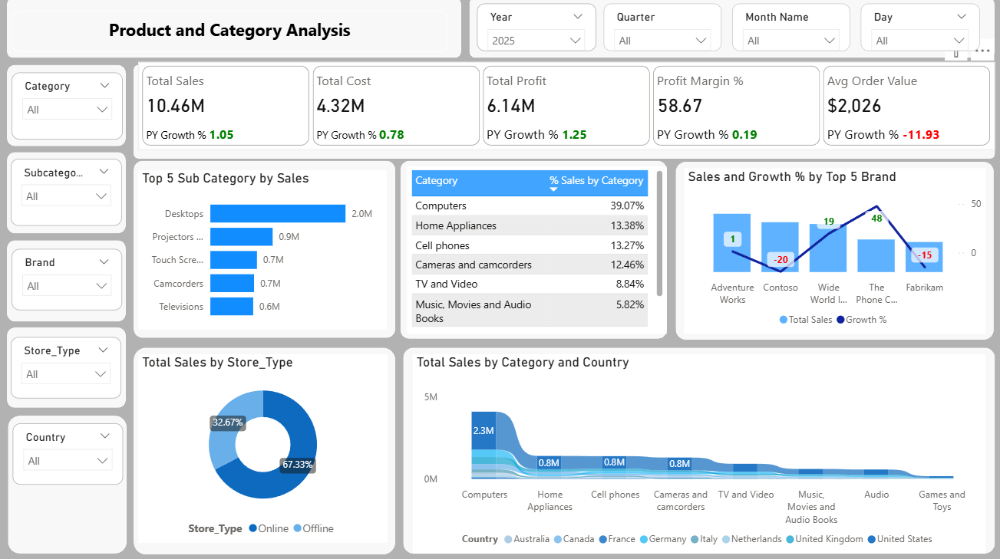

# 📊 Global Electronics Retail — Executive Analytics Suite (Power BI)

## 🔍 Project Overview

This repository presents a **multi-page, executive-grade Power BI analytics solution** built for a **global omnichannel electronics retailer** operating across **online and offline stores**.

The solution is designed to move beyond descriptive reporting and enable:
- Executive decision-making
- Growth vs. efficiency trade-off analysis
- Customer behavior understanding
- Store productivity benchmarking
- Product and category performance optimization

The dashboards follow a **consulting-style narrative**, combining KPIs, trends, segmentation, and diagnostic views.

---

## 🧭 Report Pages Overview

### 1️⃣ Customer Growth & Retention Analysis

📁 **Report Page:** `Customer Growth and Retention Analysis`  
📷 **Screenshot:**  

#### 🎯 Key Objectives
- Track customer base expansion
- Measure retention vs acquisition mix
- Identify seasonality in repeat behavior
- Analyze customer composition across geography and categories

#### 📌 Core KPIs
- **Customer Count**
- **New Customers**
- **Recurring Customers**
- **% New vs % Recurring Customers**
- **PY Growth %**

#### 📈 Key Insights Enabled
- Monthly trend of new vs recurring customers
- Retention dominance in later months of the year
- Country-level comparison of customer loyalty
- Category-wise contribution to repeat purchases

#### 🔎 Business Questions Answered
- Is growth driven by acquisition or retention?
- Which months show retention risk?
- Which countries have the strongest repeat behavior?

---

### 2️⃣ Executive Summary — Business Performance Overview

📁 **Report Page:** `Executive Summary Business Performance Overview`  
📷 **Screenshot:**  

#### 🎯 Purpose
A **C-suite snapshot** summarizing overall commercial performance with immediate callouts on risks and opportunities.

#### 📌 Core KPIs
- **Total Sales**
- **Total Profit**
- **Profit Margin %**
- **Customer Count**
- **Average Order Value (AOV)**
- **PY Growth % across all metrics**

#### 🚨 Executive Callout
> **Top Issue:**  
> *Average Order Value declined ~12% YoY despite sales and customer growth — indicating basket dilution and suboptimal cross-sell.*

#### 📊 Supporting Views
- Top 5 Categories by Sales
- Country contribution to total revenue
- Gender-based sales split
- Online vs Offline channel mix
- Sales & Margin by Age Band

#### 🔎 Business Questions Answered
- Is revenue growth profitable?
- Are we trading margin for volume?
- Which customer segments drive higher profitability?

---

### 3️⃣ Product & Category Analysis

📁 **Report Page:** `Product and Category Analysis`  
📷 **Screenshot:**  

#### 🎯 Purpose
Enable **category managers and merchandising teams** to identify:
- Revenue drivers
- Margin leakages
- Brand-level growth dynamics

#### 📌 Core KPIs
- **Total Sales**
- **Total Cost**
- **Total Profit**
- **Profit Margin %**
- **Average Order Value**
- **PY Growth %**

#### 📊 Key Visuals
- Top 5 Sub-Categories by Sales
- Category % Contribution
- Sales & Growth % by Top Brands
- Store Type (Online vs Offline) Sales Split
- Category performance by Country

#### 🔎 Business Questions Answered
- Which categories drive disproportionate revenue?
- Which brands show declining growth?
- Where is margin strong but scale limited?
- How does category performance vary geographically?

---

### 4️⃣ Store Performance & Productivity

📁 **Report Page:** `Store Performance`  
📷 **Screenshot:**  

#### 🎯 Purpose
Evaluate **store-level efficiency and scalability**, not just topline sales.

#### 📌 Core KPIs
- **Total Sales**
- **Total Profit**
- **Profit Margin %**
- **Sales per Sq. Meter**
- **Profit per Sq. Meter**
- **PY Growth %**

#### 📊 Key Visuals
- Monthly Sales & Profit Trends
- Cumulative Sales Since Store Opening
- Store-level productivity table
- Benchmarking stores by area efficiency

#### 🔎 Business Questions Answered
- Which stores scale profitably?
- Are larger stores actually more efficient?
- Which stores need resizing, relocation, or format change?

---

## 🏗️ Data Model Highlights

- **Fact Table:** Sales Transactions
- **Dimensions:** Date, Customers, Products, Stores, Geography
- Star-schema optimized for:
  - Time intelligence
  - Customer lifecycle analysis
  - Store productivity metrics

---

## 🧠 Analytical Techniques Used

- Advanced DAX Measures
  - YoY Growth %
  - Retention vs Acquisition logic
  - AOV & Margin diagnostics
- Time Intelligence (PY, YTD)
- Segmentation (Age Band, Gender, Store Type)
- Productivity normalization (per SqM)

---

## 🧩 Tools & Technologies

- **Power BI Desktop**
- **DAX**
- **Power Query**
- **Dimensional Modeling**
- **Executive Dashboard Design**

---

## 🚀 Business Impact

This analytics suite enables leadership to:
- Identify **hidden efficiency issues** (AOV decline)
- Balance **growth vs profitability**
- Prioritize **high-ROI categories and stores**
- Make **data-backed merchandising and expansion decisions**

---

## 👤 Author

**Soumitra Das**  
Senior Analytics & Business Intelligence Professional  

---

⭐ *If you find this project insightful, consider starring the repository.*

